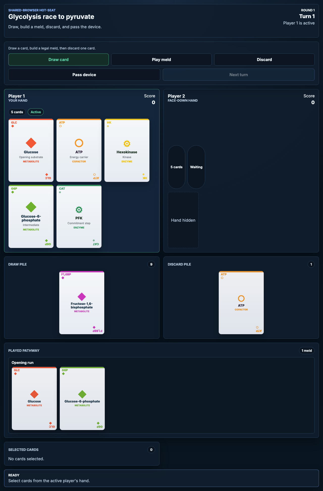
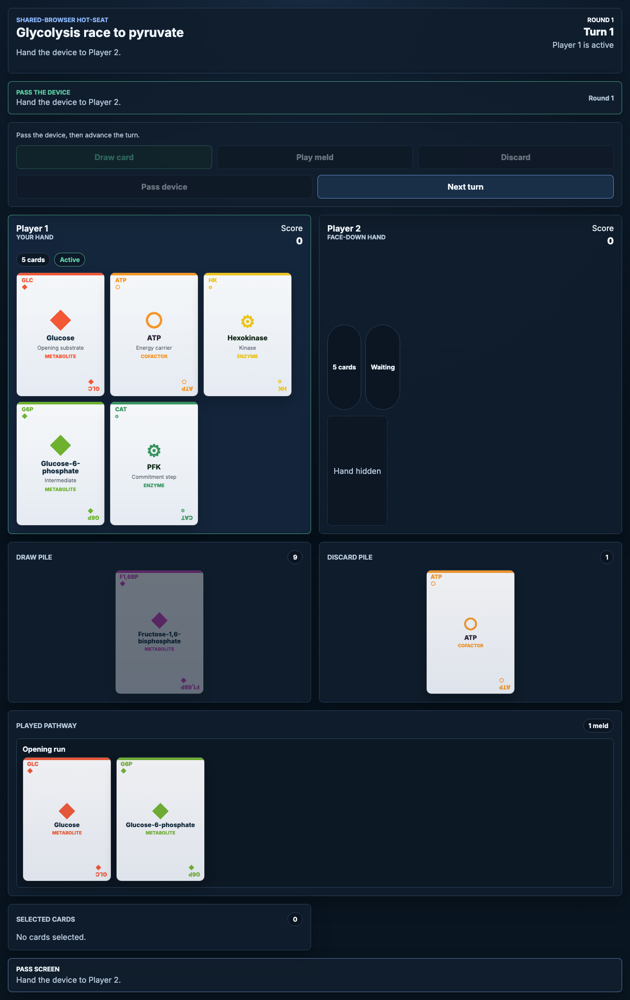

# Glycolysis race to pyruvate

Glycolysis Race to Pyruvate is a two-player local hot-seat card game where players race through glycolysis by building legal reaction melds, managing cofactors, and clearing their hand first.

The game runs entirely in the browser from a static build. It needs no backend, account, or network connection: two players share one tab and pass the device between turns.

## Screenshots

<!-- screenshots:begin (managed by screenshot-docs) -->

<!-- screenshots:end -->

## Quick start

1. Run `npm run setup` once after cloning to install dependencies.
2. Run `npm run serve` to build and preview the game in a browser.
3. Run `npm run build` to produce the GitHub Pages build in `dist/`.

Each `npm run` task mirrors a front-door shell script; see
[docs/USAGE.md](docs/USAGE.md) for the full command list.

## v1 rules

- Two-player local hot-seat in one browser tab; no backend or network.
- On a turn, the active player can draw, play a meld, discard one card, then
  pass the device.
- The inactive player's hand stays hidden until the turn changes.
- A legal meld must match a glycolysis reaction exactly, including the required
  ATP, ADP, NAD+, and NADH cofactors.
- The reaction set covers normal steps, ATP investment, GAPDH redox, ATP
  payoff, and the aldolase branch through DHAP plus TPI.
- Emptying a hand ends the round; the next round resets hands and the starting
  player.

## Documentation

- [docs/INSTALL.md](docs/INSTALL.md): setup, requirements, and verify steps.
- [docs/USAGE.md](docs/USAGE.md): commands, scripts, and how to play.
- [docs/CODE_ARCHITECTURE.md](docs/CODE_ARCHITECTURE.md): components and data
  flow.
- [docs/FILE_STRUCTURE.md](docs/FILE_STRUCTURE.md): directory map and where to
  add work.
- [docs/CHANGELOG.md](docs/CHANGELOG.md): dated record of changes.
- [docs/REPO_STYLE.md](docs/REPO_STYLE.md): repo conventions and file
  placement.
- [docs/TYPESCRIPT_STYLE.md](docs/TYPESCRIPT_STYLE.md): TypeScript coding rules.
- [docs/PYTEST_STYLE.md](docs/PYTEST_STYLE.md): pytest hygiene rules.

## License

Code is under the MIT license; see [LICENSE.MIT.md](LICENSE.MIT.md).
